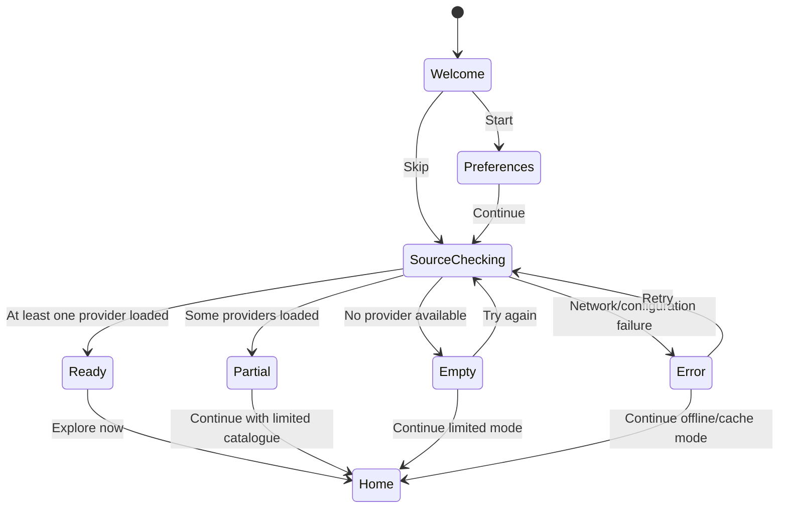

# FM-HuB-24 Onboarding Prototype

এই নথিটি সাধারণ user-এর জন্য একটি **prototype-level onboarding structure**। এটি production patch নয়; বর্তমান Android app-এর Kotlin + Jetpack Compose + ViewModel architecture ধরে কোথায় কোন code বসতে পারে তা দেখানোর sample।

মূল লক্ষ্য:

```text
Install → Understand → Choose preferences → Check sources → See real content → Play
```

## 1. User flow schema



`SourceChecking`-এর সময় technical implementation চলবে, কিন্তু user-facing copy হবে সহজ ভাষায়। `ClassNotFoundException`, `API mismatch` বা Supabase URL-এর মতো error সরাসরি onboarding-এ দেখানো হবে না।

## 2. Suggested package structure

```text
app/src/main/java/com/fmhub24/app/
├── onboarding/
│   ├── OnboardingRoute.kt
│   ├── OnboardingViewModel.kt
│   ├── OnboardingState.kt
│   ├── OnboardingEvent.kt
│   ├── OnboardingPreferencesRepository.kt
│   └── SourceCheckResult.kt
├── ui/screens/onboarding/
│   ├── WelcomeStep.kt
│   ├── PreferencesStep.kt
│   ├── SourceCheckingStep.kt
│   └── OnboardingResultStep.kt
└── ui/navigation/
    └── NavGraph.kt
```

বর্তমান `SplashScreen`-কে পুরোপুরি onboarding বানানোর বদলে Splash-কে short startup loading রাখা ভালো। নতুন user হলে Splash-এর পরে onboarding route দেখানো হবে; পুরোনো user সরাসরি Home-এ যাবে।

## 3. State model

`OnboardingState.kt`

```kotlin
package com.fmhub24.app.onboarding

sealed interface OnboardingStep {
    data object Welcome : OnboardingStep
    data object Preferences : OnboardingStep
    data object CheckingSources : OnboardingStep
    data class Result(val status: ResultStatus) : OnboardingStep
}

enum class ResultStatus {
    Ready,
    Partial,
    Empty,
    Error,
}

enum class ContentType(val label: String) {
    Movie("Movies"),
    Series("Series"),
    Anime("Anime"),
    Documentary("Documentary"),
}

enum class ContentLanguage(val label: String) {
    Bangla("বাংলা"),
    English("English"),
    Hindi("हिन्दी"),
    Korean("한국어"),
}

data class UserPreferences(
    val languages: Set<ContentLanguage> = emptySet(),
    val contentTypes: Set<ContentType> = emptySet(),
)

data class SourceSummary(
    val available: Int,
    val loadedProviders: Int,
    val failed: Int,
)

data class OnboardingUiState(
    val step: OnboardingStep = OnboardingStep.Welcome,
    val preferences: UserPreferences = UserPreferences(),
    val sourceSummary: SourceSummary? = null,
    val userMessage: String? = null,
    val canContinue: Boolean = true,
)
```

## 4. Events

`OnboardingEvent.kt`

```kotlin
package com.fmhub24.app.onboarding

sealed interface OnboardingEvent {
    data object Start : OnboardingEvent
    data object Skip : OnboardingEvent
    data object Continue : OnboardingEvent
    data class ToggleLanguage(val language: ContentLanguage) : OnboardingEvent
    data class ToggleContentType(val type: ContentType) : OnboardingEvent
    data object RetrySources : OnboardingEvent
    data object ContinueWithLimitedMode : OnboardingEvent
    data object Finish : OnboardingEvent
}
```

## 5. Persistence schema

Onboarding state-এর জন্য আলাদা Room table প্রয়োজন নেই। ছোট preference-এর জন্য DataStore যথেষ্ট।

```text
DataStore: user_preferences

onboarding_completed: Boolean
selected_languages: Set<String>
selected_content_types: Set<String>
last_source_check_at: Long?
last_source_status: READY | PARTIAL | EMPTY | ERROR
```

`OnboardingPreferencesRepository.kt`

```kotlin
package com.fmhub24.app.onboarding

import android.content.Context
import androidx.datastore.preferences.core.booleanPreferencesKey
import androidx.datastore.preferences.core.edit
import androidx.datastore.preferences.core.longPreferencesKey
import androidx.datastore.preferences.core.stringSetPreferencesKey
import androidx.datastore.preferences.preferencesDataStore
import dagger.hilt.android.qualifiers.ApplicationContext
import kotlinx.coroutines.flow.Flow
import kotlinx.coroutines.flow.map
import javax.inject.Inject
import javax.inject.Singleton

private val Context.onboardingDataStore by preferencesDataStore("onboarding_preferences")

@Singleton
class OnboardingPreferencesRepository @Inject constructor(
    @ApplicationContext private val context: Context,
) {
    private object Keys {
        val completed = booleanPreferencesKey("onboarding_completed")
        val languages = stringSetPreferencesKey("selected_languages")
        val contentTypes = stringSetPreferencesKey("selected_content_types")
        val lastSourceCheckAt = longPreferencesKey("last_source_check_at")
        val lastSourceStatus = stringSetPreferencesKey("last_source_status")
    }

    val completed: Flow<Boolean> = context.onboardingDataStore.data
        .map { it[Keys.completed] ?: false }

    val preferences: Flow<UserPreferences> = context.onboardingDataStore.data
        .map { data ->
            UserPreferences(
                languages = data[Keys.languages].orEmpty().mapNotNull {
                    runCatching { ContentLanguage.valueOf(it) }.getOrNull()
                }.toSet(),
                contentTypes = data[Keys.contentTypes].orEmpty().mapNotNull {
                    runCatching { ContentType.valueOf(it) }.getOrNull()
                }.toSet(),
            )
        }

    suspend fun savePreferences(value: UserPreferences) {
        context.onboardingDataStore.edit { data ->
            data[Keys.languages] = value.languages.map { it.name }.toSet()
            data[Keys.contentTypes] = value.contentTypes.map { it.name }.toSet()
        }
    }

    suspend fun markCompleted() {
        context.onboardingDataStore.edit { it[Keys.completed] = true }
    }

    suspend fun saveSourceStatus(status: ResultStatus) {
        context.onboardingDataStore.edit { data ->
            data[Keys.lastSourceCheckAt] = System.currentTimeMillis()
            data[Keys.lastSourceStatus] = setOf(status.name)
        }
    }
}
```

`lastSourceStatus`-এর জন্য বাস্তবে `stringPreferencesKey` ব্যবহার করা বেশি উপযুক্ত। উপরের code-টি schema বোঝানোর sample; production-এ type-টি `stringPreferencesKey("last_source_status")` করে `data[Keys.lastSourceStatus] = status.name` ব্যবহার করা উচিত।

## 6. Source checking abstraction

Onboarding ViewModel-কে সরাসরি Retrofit, Supabase বা PluginManager-এর details জানা উচিত নয়। একটি ছোট use-case বা facade রাখুন।

```kotlin
package com.fmhub24.app.onboarding

import com.fmhub24.app.data.repository.ExtensionRepository
import com.fmhub24.app.plugins.PluginManager
import javax.inject.Inject

sealed interface SourceCheckResult {
    data class Success(val summary: SourceSummary) : SourceCheckResult
    data class Partial(val summary: SourceSummary) : SourceCheckResult
    data object Empty : SourceCheckResult
    data class Failure(val message: String? = null) : SourceCheckResult
}

class CheckContentSourcesUseCase @Inject constructor(
    private val extensionRepository: ExtensionRepository,
    private val pluginManager: PluginManager,
) {
    suspend operator fun invoke(): SourceCheckResult {
        val remote = extensionRepository.getActiveExtensions()

        return remote.fold(
            onSuccess = { extensions ->
                if (extensions.isEmpty()) return SourceCheckResult.Empty

                extensionRepository.syncFromRemote(extensions)
                val loaded = pluginManager.providerEntries.value.size
                val failed = extensions.size - loaded
                val summary = SourceSummary(
                    available = extensions.size,
                    loadedProviders = loaded,
                    failed = failed.coerceAtLeast(0),
                )

                when {
                    loaded > 0 && failed == 0 -> SourceCheckResult.Success(summary)
                    loaded > 0 -> SourceCheckResult.Partial(summary)
                    else -> SourceCheckResult.Failure(
                        "কোনো content source চালু করা যায়নি"
                    )
                }
            },
            onFailure = {
                SourceCheckResult.Failure()
            },
        )
    }
}
```

এই abstraction-এ একটি গুরুত্বপূর্ণ product rule আছে: **active extension row থাকলেই source ready বলা যাবে না**। অন্তত একটি provider সফলভাবে load হয়েছে কি না যাচাই করতে হবে।

## 7. ViewModel

`OnboardingViewModel.kt`

```kotlin
package com.fmhub24.app.onboarding

import androidx.lifecycle.ViewModel
import androidx.lifecycle.viewModelScope
import dagger.hilt.android.lifecycle.HiltViewModel
import javax.inject.Inject
import kotlinx.coroutines.flow.MutableStateFlow
import kotlinx.coroutines.flow.StateFlow
import kotlinx.coroutines.flow.asStateFlow
import kotlinx.coroutines.flow.update
import kotlinx.coroutines.launch

@HiltViewModel
class OnboardingViewModel @Inject constructor(
    private val preferencesRepository: OnboardingPreferencesRepository,
    private val checkContentSources: CheckContentSourcesUseCase,
) : ViewModel() {
    private val _uiState = MutableStateFlow(OnboardingUiState())
    val uiState: StateFlow<OnboardingUiState> = _uiState.asStateFlow()

    fun onEvent(event: OnboardingEvent) {
        when (event) {
            OnboardingEvent.Start -> {
                _uiState.update { it.copy(step = OnboardingStep.Preferences) }
            }

            OnboardingEvent.Skip -> {
                checkSources()
            }

            OnboardingEvent.Continue -> {
                savePreferencesAndCheck()
            }

            is OnboardingEvent.ToggleLanguage -> {
                _uiState.update { state ->
                    val selected = state.preferences.languages.toMutableSet()
                    if (!selected.add(event.language)) selected.remove(event.language)
                    state.copy(
                        preferences = state.preferences.copy(languages = selected),
                    )
                }
            }

            is OnboardingEvent.ToggleContentType -> {
                _uiState.update { state ->
                    val selected = state.preferences.contentTypes.toMutableSet()
                    if (!selected.add(event.type)) selected.remove(event.type)
                    state.copy(
                        preferences = state.preferences.copy(contentTypes = selected),
                    )
                }
            }

            OnboardingEvent.RetrySources -> checkSources()
            OnboardingEvent.ContinueWithLimitedMode -> finish()
            OnboardingEvent.Finish -> finish()
        }
    }

    private fun savePreferencesAndCheck() {
        viewModelScope.launch {
            val preferences = _uiState.value.preferences
            preferencesRepository.savePreferences(preferences)
            checkSources()
        }
    }

    private fun checkSources() {
        viewModelScope.launch {
            _uiState.update {
                it.copy(
                    step = OnboardingStep.CheckingSources,
                    userMessage = null,
                    canContinue = false,
                )
            }

            when (val result = checkContentSources()) {
                is SourceCheckResult.Success -> {
                    preferencesRepository.saveSourceStatus(ResultStatus.Ready)
                    _uiState.update {
                        it.copy(
                            step = OnboardingStep.Result(ResultStatus.Ready),
                            sourceSummary = result.summary,
                            canContinue = true,
                        )
                    }
                }

                is SourceCheckResult.Partial -> {
                    preferencesRepository.saveSourceStatus(ResultStatus.Partial)
                    _uiState.update {
                        it.copy(
                            step = OnboardingStep.Result(ResultStatus.Partial),
                            sourceSummary = result.summary,
                            canContinue = true,
                        )
                    }
                }

                SourceCheckResult.Empty -> {
                    preferencesRepository.saveSourceStatus(ResultStatus.Empty)
                    _uiState.update {
                        it.copy(
                            step = OnboardingStep.Result(ResultStatus.Empty),
                            canContinue = true,
                        )
                    }
                }

                is SourceCheckResult.Failure -> {
                    preferencesRepository.saveSourceStatus(ResultStatus.Error)
                    _uiState.update {
                        it.copy(
                            step = OnboardingStep.Result(ResultStatus.Error),
                            userMessage = result.message,
                            canContinue = true,
                        )
                    }
                }
            }
        }
    }

    private fun finish() {
        viewModelScope.launch {
            preferencesRepository.markCompleted()
            _uiState.update {
                it.copy(step = OnboardingStep.Result(ResultStatus.Ready))
            }
        }
    }
}
```

Production implementation-এ `finish()`-এর পরিবর্তে navigation event আলাদা `SharedFlow` দিয়ে পাঠানো ভালো, যাতে configuration state পরিবর্তনের সঙ্গে navigation state মিশে না যায়।

## 8. Compose route

`OnboardingRoute.kt`

```kotlin
package com.fmhub24.app.onboarding

import androidx.compose.runtime.Composable
import androidx.compose.runtime.getValue
import androidx.hilt.navigation.compose.hiltViewModel
import androidx.lifecycle.compose.collectAsStateWithLifecycle

@Composable
fun OnboardingRoute(
    onFinished: () -> Unit,
    viewModel: OnboardingViewModel = hiltViewModel(),
) {
    val state by viewModel.uiState.collectAsStateWithLifecycle()

    OnboardingScreen(
        state = state,
        onEvent = { event ->
            when (event) {
                OnboardingEvent.Finish,
                OnboardingEvent.ContinueWithLimitedMode -> {
                    viewModel.onEvent(event)
                    onFinished()
                }
                else -> viewModel.onEvent(event)
            }
        },
    )
}
```

## 9. Main Compose screen

`OnboardingScreen.kt`

```kotlin
@Composable
fun OnboardingScreen(
    state: OnboardingUiState,
    onEvent: (OnboardingEvent) -> Unit,
) {
    Surface(
        modifier = Modifier.fillMaxSize(),
        color = Color(0xFF0B0B0B),
    ) {
        when (val step = state.step) {
            OnboardingStep.Welcome -> WelcomeStep(
                onStart = { onEvent(OnboardingEvent.Start) },
                onSkip = { onEvent(OnboardingEvent.Skip) },
            )

            OnboardingStep.Preferences -> PreferencesStep(
                preferences = state.preferences,
                onLanguageToggle = {
                    onEvent(OnboardingEvent.ToggleLanguage(it))
                },
                onTypeToggle = {
                    onEvent(OnboardingEvent.ToggleContentType(it))
                },
                onContinue = { onEvent(OnboardingEvent.Continue) },
            )

            OnboardingStep.CheckingSources -> SourceCheckingStep()

            is OnboardingStep.Result -> OnboardingResultStep(
                status = step.status,
                summary = state.sourceSummary,
                message = state.userMessage,
                onExplore = { onEvent(OnboardingEvent.Finish) },
                onRetry = { onEvent(OnboardingEvent.RetrySources) },
                onLimitedMode = {
                    onEvent(OnboardingEvent.ContinueWithLimitedMode)
                },
            )
        }
    }
}
```

## 10. Welcome screen

```kotlin
@Composable
fun WelcomeStep(
    onStart: () -> Unit,
    onSkip: () -> Unit,
) {
    Column(
        modifier = Modifier
            .fillMaxSize()
            .padding(horizontal = 24.dp, vertical = 32.dp),
        verticalArrangement = Arrangement.SpaceBetween,
    ) {
        Column {
            Text(
                text = "আপনার বিনোদন, এক জায়গায়",
                color = Color.White,
                fontSize = 30.sp,
                fontWeight = FontWeight.Bold,
            )
            Spacer(Modifier.height(12.dp))
            Text(
                text = "মুভি, সিরিজ এবং আরও অনেক কিছু খুঁজুন, দেখুন এবং পরে offline উপভোগ করুন।",
                color = Color.LightGray,
                fontSize = 16.sp,
                lineHeight = 24.sp,
            )
        }

        Column(verticalArrangement = Arrangement.spacedBy(12.dp)) {
            Button(
                onClick = onStart,
                modifier = Modifier.fillMaxWidth(),
                colors = ButtonDefaults.buttonColors(
                    containerColor = Color(0xFFFF7A00),
                ),
            ) {
                Text("শুরু করি")
            }
            TextButton(
                onClick = onSkip,
                modifier = Modifier.fillMaxWidth(),
            ) {
                Text("এখন নয়")
            }
        }
    }
}
```

## 11. Preferences screen

```kotlin
@Composable
fun PreferencesStep(
    preferences: UserPreferences,
    onLanguageToggle: (ContentLanguage) -> Unit,
    onTypeToggle: (ContentType) -> Unit,
    onContinue: () -> Unit,
) {
    Column(
        modifier = Modifier
            .fillMaxSize()
            .verticalScroll(rememberScrollState())
            .padding(24.dp),
    ) {
        Text("আপনার পছন্দ বেছে নিন", color = Color.White, fontSize = 26.sp)
        Text(
            "পরে Settings থেকে এগুলো পরিবর্তন করতে পারবেন।",
            color = Color.Gray,
            modifier = Modifier.padding(top = 8.dp),
        )

        PreferenceGroup(title = "ভাষা") {
            ContentLanguage.entries.forEach { language ->
                FilterChip(
                    selected = language in preferences.languages,
                    onClick = { onLanguageToggle(language) },
                    label = { Text(language.label) },
                    modifier = Modifier.padding(end = 8.dp, bottom = 8.dp),
                )
            }
        }

        PreferenceGroup(title = "যা দেখতে চান") {
            ContentType.entries.forEach { type ->
                FilterChip(
                    selected = type in preferences.contentTypes,
                    onClick = { onTypeToggle(type) },
                    label = { Text(type.label) },
                    modifier = Modifier.padding(end = 8.dp, bottom = 8.dp),
                )
            }
        }

        Spacer(Modifier.height(24.dp))
        Button(
            onClick = onContinue,
            modifier = Modifier.fillMaxWidth(),
        ) {
            Text("Continue")
        }
    }
}
```

## 12. Source checking screen

```kotlin
@Composable
fun SourceCheckingStep() {
    Column(
        modifier = Modifier
            .fillMaxSize()
            .padding(24.dp),
        verticalArrangement = Arrangement.Center,
        horizontalAlignment = Alignment.CenterHorizontally,
    ) {
        CircularProgressIndicator(color = Color(0xFFFF7A00))
        Spacer(Modifier.height(20.dp))
        Text(
            text = "আপনার catalogue প্রস্তুত করছি",
            color = Color.White,
            fontSize = 22.sp,
            textAlign = TextAlign.Center,
        )
        Spacer(Modifier.height(8.dp))
        Text(
            text = "কিছুক্ষণ সময় লাগতে পারে।",
            color = Color.Gray,
            textAlign = TextAlign.Center,
        )
    }
}
```

এই loading screen-এ fake delay ব্যবহার করা যাবে না। এখানে বাস্তব source fetch/load coroutine চলবে। কাজ শেষ হলে state পরিবর্তন হবে।

## 13. Result states

```kotlin
@Composable
fun OnboardingResultStep(
    status: ResultStatus,
    summary: SourceSummary?,
    message: String?,
    onExplore: () -> Unit,
    onRetry: () -> Unit,
    onLimitedMode: () -> Unit,
) {
    val title: String
    val body: String

    when (status) {
        ResultStatus.Ready -> {
            title = "সব প্রস্তুত"
            body = "আপনার জন্য ${summary?.loadedProviders ?: 0}টি content source প্রস্তুত আছে।"
        }
        ResultStatus.Partial -> {
            title = "আংশিকভাবে প্রস্তুত"
            body = "কিছু source এখন available নয়। যেগুলো কাজ করছে সেগুলো দিয়ে শুরু করতে পারেন।"
        }
        ResultStatus.Empty -> {
            title = "এখনও content পাওয়া যায়নি"
            body = "এই মুহূর্তে কোনো content source available নেই। পরে আবার চেষ্টা করুন।"
        }
        ResultStatus.Error -> {
            title = "সংযোগ করা যায়নি"
            body = message ?: "Content source-এর সঙ্গে যোগাযোগ করা যাচ্ছে না।"
        }
    }

    Column(
        modifier = Modifier
            .fillMaxSize()
            .padding(24.dp),
        verticalArrangement = Arrangement.Center,
    ) {
        Text(title, color = Color.White, fontSize = 28.sp)
        Spacer(Modifier.height(12.dp))
        Text(body, color = Color.LightGray, fontSize = 16.sp, lineHeight = 24.sp)
        Spacer(Modifier.height(28.dp))

        when (status) {
            ResultStatus.Ready -> PrimaryButton("Explore now", onExplore)
            ResultStatus.Partial -> {
                PrimaryButton("Continue", onExplore)
                TextButton(onClick = onRetry) { Text("Refresh sources") }
            }
            ResultStatus.Empty, ResultStatus.Error -> {
                PrimaryButton("Try again", onRetry)
                TextButton(onClick = onLimitedMode) {
                    Text("Continue with limited mode")
                }
            }
        }
    }
}
```

## 14. Navigation integration

বর্তমান `NavGraph`-এ onboarding route যোগ করার জন্য navigation decision startup-এ নিতে হবে। এটি `SplashViewModel` অথবা একটি root-level `StartupViewModel`-এ রাখা ভালো।

```kotlin
sealed class StartupDestination {
    data object Onboarding : StartupDestination()
    data object Home : StartupDestination()
}
```

একটি সাধারণ route structure:

```kotlin
NavHost(
    navController = navController,
    startDestination = Screen.Splash.route,
) {
    composable(Screen.Splash.route) {
        SplashRoute(
            onReady = { onboardingCompleted ->
                navController.navigate(
                    if (onboardingCompleted) Screen.Home.route
                    else Screen.Onboarding.route
                ) {
                    popUpTo(Screen.Splash.route) { inclusive = true }
                }
            }
        )
    }

    composable(Screen.Onboarding.route) {
        OnboardingRoute(
            onFinished = {
                navController.navigate(Screen.Home.route) {
                    popUpTo(Screen.Onboarding.route) { inclusive = true }
                }
            }
        )
    }

    composable(Screen.Home.route) {
        HomeRoute()
    }
}
```

`SplashRoute`-এ `preferencesRepository.completed.first()` দিয়ে সিদ্ধান্ত নেওয়া যায়। তবে source checking-কে Splash-এর ভেতরে লুকিয়ে না রেখে onboarding-এর দৃশ্যমান `CheckingSources` step-এ রাখা ভালো। এতে user বুঝতে পারে app কী করছে।

## 15. First-launch rule

প্রথমবার app চালু হলে:

```text
completed = false → Welcome
```

Onboarding skip করলে:

```text
completed = true → Home
```

কিন্তু source check চালানো উচিত। Skip মানে onboarding screens বাদ দেওয়া; source validation বাদ দেওয়া নয়।

পরবর্তী launch-এ:

```text
completed = true → Home
```

তবে source sync silently background-এ চলতে পারে। যদি cached source থাকে, Home আগে দেখিয়ে পরে status banner update করা ভালো।

## 16. Important product guardrails

### Active row ≠ working source

শুধু Supabase row active হলেই Ready state দেখাবেন না। কমপক্ষে একটি provider load এবং একটি lightweight capability check সফল হতে হবে।

### Error message দুই স্তরে রাখুন

User-facing:

```text
এই source এখন unavailable। আবার চেষ্টা করুন অথবা অন্য source ব্যবহার করুন।
```

Advanced details:

```text
File: example.cs3
Reason: plugin API mismatch
Expected: v1
Found: v2
```

### Fake personalization করবেন না

User language/category বেছে নিলে Home screen-এ সত্যিই তার প্রভাব থাকতে হবে। না হলে preferences step বাদ দিয়ে সরাসরি source setup দেখানো ভালো।

### Onboarding repeatable হতে হবে

Settings-এ রাখুন:

```text
Personalize experience
Refresh content sources
Run onboarding again
```

## 17. Minimum verification checklist

Prototype merge করার আগে অন্তত এই flow test করুন:

| Scenario | Expected result |
|---|---|
| Fresh install, valid source | Welcome → preferences → source check → Home |
| User taps Skip | Source check হয়, তারপর Home বা empty state |
| No active extensions | Friendly empty state, crash নয় |
| Active row but plugin fails | Partial বা Error state, false Ready নয় |
| Network unavailable | Retry ও limited mode দেখা যায় |
| Existing user | Onboarding bypass করে Home |
| App reinstall/clear data | Onboarding আবার আসে |
| Settings থেকে rerun | Onboarding state reset হয়ে flow আবার শুরু হয় |

## 18. Recommended implementation order

1. `OnboardingState`, `OnboardingEvent` এবং `OnboardingViewModel` যোগ করুন।
2. DataStore-এ completion ও preferences persistence যোগ করুন।
3. Source check-কে reusable use-case/facade-এ বের করুন।
4. Welcome, Preferences এবং Result screen তৈরি করুন।
5. Splash থেকে onboarding/home routing যোগ করুন।
6. Empty/error state test করুন।
7. তারপর visual polish, animation এবং illustrations যোগ করুন।

সবচেয়ে গুরুত্বপূর্ণ MVP হলো **সুন্দর animation নয়; empty source অবস্থায়ও user যেন বুঝতে পারে কী হয়েছে এবং পরের কাজ কী**।
